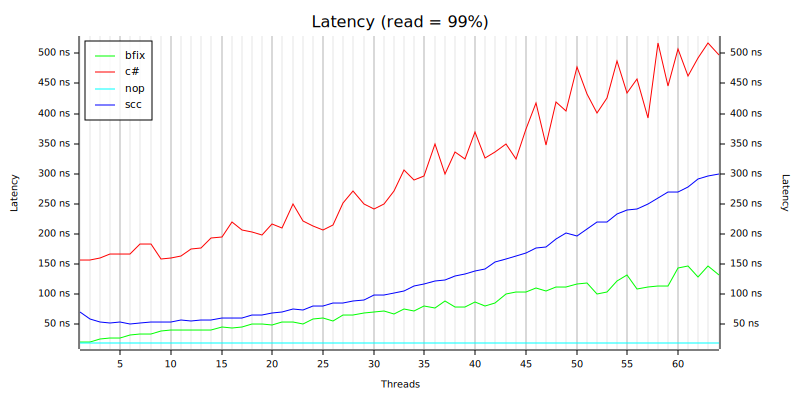

# map-bench-dot-net
This repository contains ConcurrentDictionary benchmarking code that generates data for my [rust map performance comparison]( https://github.com/ZacWalk/map-bench-rust). This was useful for research I was doing on how NUMA architectures affect performance.

It generates a rust file that is included in the other framework for reference. The data is combined to produce results as below.

This chart shows results for a workload with 99% reads. The chart shows average latency. Lower is better.

- [bfix](https://github.com/ZacWalk/bfix-map) = my sharded simd probing hash map  
- c# = ConcurrentDictionary
- scc = shared map optimistic locking
- nop = no-operation to measure test framework overhead

The test has the following parameters:

- Initial items: 500,000 
- Operation count: 55,000,000 split over specified threads
- Operation types: 99% read, 1% upsert
- Hash function: ahash
- Hardware: HB120-64rs Azure VM with 64 vCPUs, 4 numa nodes, 456 GiB of RAM. The VM was running Windows.
